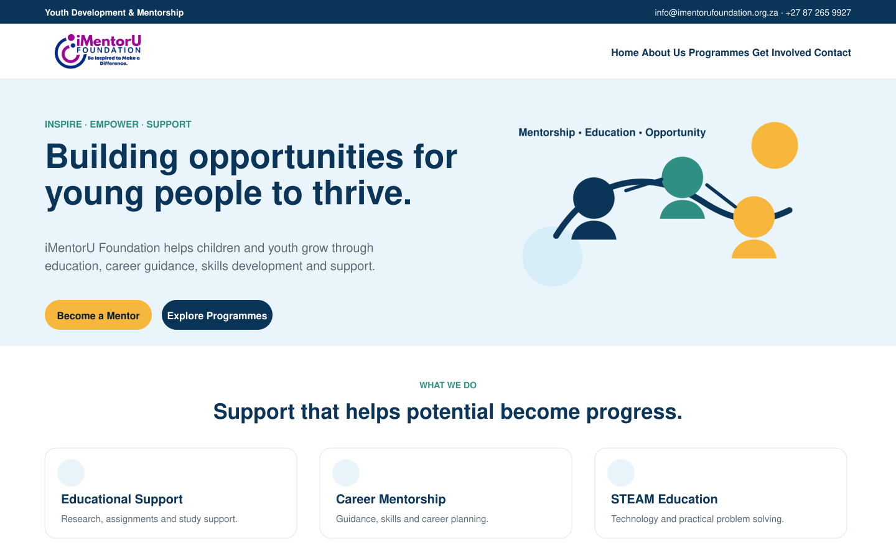
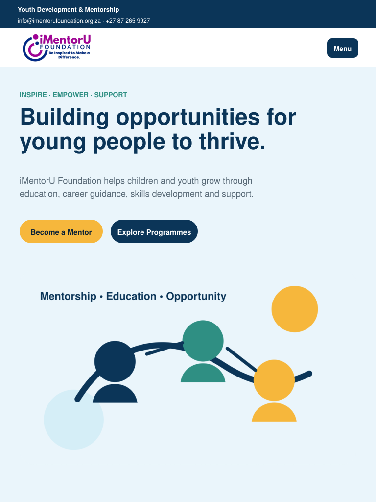
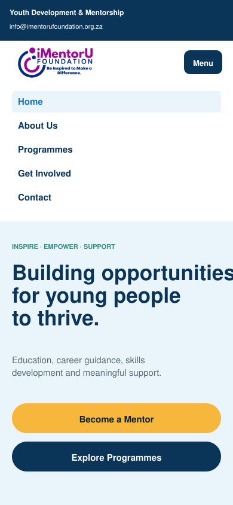

# iMentorU Foundation Website

WEDE5020 Part 2 final submission by **Reitumetse Tleane (ST10526207)**.

This repository contains the updated five-page iMentorU Foundation website. Part 2 builds on the corrected Part 1 submission by applying a shared external stylesheet, a responsive desktop-first layout, responsive images, interactive states, accessibility improvements, device-size testing evidence and detailed version-control documentation.

## Website pages

- `index.html` - Home page and organisation overview
- `about.html` - Organisation history, mission, vision and values
- `programmes.html` - Six programme areas and short-course information
- `volunteer.html` - Mentoring, volunteering and partnership information
- `contact.html` - Contact details, support information and message form

## Part 1 feedback corrections

- Added a second proposal for the same organisation.
- Added desktop and mobile wireframes for both design proposals.
- Replaced the general budget statement with an itemised first-year estimate.
- Added meaningful comments throughout the HTML, CSS and JavaScript.
- Added a complete README, changelog, sitemap and research structure.
- Created descriptive Git commits and instructions for capturing GitHub evidence.

## Part 2 CSS implementation

### External stylesheet and cascade

All five HTML pages link to `css/style.css`. Shared variables, typography, navigation, buttons, cards, forms and footer rules are defined once and cascade across the complete website. Page-specific differences use reusable classes instead of duplicate inline styling.

### Base and typography styles

- A universal reset applies `box-sizing: border-box` and removes inconsistent default spacing.
- Arial with Helvetica and sans-serif fallbacks provides readable typography.
- `rem`, `em`, percentages and `clamp()` create scalable text and spacing.
- A consistent heading scale, line height, letter spacing and colour system is applied.

### Desktop layout and visual styling

- Flexbox structures the contact bar, navigation and call-to-action groups.
- CSS Grid structures the hero, cards, statistics, programmes, forms and footer.
- Named `grid-template-areas` organise the desktop hero layout.
- Borders, rounded corners, shadows and branded backgrounds establish visual hierarchy.
- `:hover`, `:focus-visible` and `:active` states support mouse and keyboard interaction.

### Responsive design

- Desktop: above 850 px, with multi-column navigation, hero and content grids.
- Tablet: 560-850 px, with mobile navigation, a stacked hero and two-column cards.
- Mobile: below 560 px, with single-column content, full-width buttons and adjusted typography.
- The navigation button exposes its open state using `aria-expanded`.
- A skip link and visible keyboard-focus styles improve accessibility.

### Responsive images

- The organisation logo uses `srcset` and `sizes` at 211 px and 422 px resolutions.
- The home-page hero uses a `picture` element.
- WebP sources reduce file size where supported.
- PNG sources provide a fallback at 480 px and 960 px resolutions.
- Explicit image dimensions reduce layout movement while pages load.

## Responsive testing evidence

The layouts were reviewed at the three required screen sizes. Evidence files are stored in `evidence/responsive`.

### Desktop 1440 by 900



Desktop uses a full horizontal navigation menu, a two-column hero and three-column feature cards.

### Tablet 768 by 1024



Tablet replaces the horizontal navigation with a menu button, stacks the hero content and keeps suitable multi-column content where space allows.

### Mobile 390 by 844



Mobile uses an open vertical navigation example, single-column content, smaller typography and full-width action buttons.

## Folder structure

```text
.
|-- index.html
|-- about.html
|-- programmes.html
|-- volunteer.html
|-- contact.html
|-- css/
|   `-- style.css
|-- js/
|   `-- main.js
|-- images/
|   |-- imentoru-foundation-official-logo.png
|   |-- imentoru-logo-211.png
|   |-- hero.svg
|   |-- hero-480.png
|   |-- hero-960.png
|   |-- hero-480.webp
|   `-- hero-960.webp
|-- docs/
|   |-- Reitumetse_Tleane_iMentorU_Proposal.docx
|   `-- sitemap.md
|-- research/
|   `-- research_notes.md
|-- evidence/
|   |-- responsive/
|   |   |-- desktop-1440x900.png
|   |   |-- tablet-768x1024.png
|   |   `-- mobile-390x844.png
|   `-- README.md
|-- CHANGELOG.md
|-- PART2_TESTING.md
|-- SUBMISSION_CHECKLIST.md
|-- GITHUB_SUBMISSION_GUIDE.md
`-- README.md
```

## How to run

1. Download or clone the repository.
2. Keep all folders and files in their current structure.
3. Open `index.html` in Chrome, Edge or Firefox.
4. Use browser developer tools to test desktop, tablet and mobile widths.
5. Test the navigation, links, forms and responsive images.

No package installation, web server or database is required.

## Testing completed

- All five pages link to the same external stylesheet.
- All navigation links and local asset paths resolve correctly.
- The layout contains desktop, tablet and mobile breakpoint rules.
- Responsive `picture`, `srcset` and `sizes` attributes are present.
- The JavaScript file passes a syntax check.
- Forms use associated labels, required fields and accessible status messages.
- The mobile menu can be opened, closed, dismissed with Escape and used by keyboard.
- The repository contains no uncommitted Part 2 changes at packaging time.

Detailed results and browser developer-tool instructions are provided in [`PART2_TESTING.md`](PART2_TESTING.md).

## Changelog

All Part 1 feedback corrections and Part 2 additions are recorded in [`CHANGELOG.md`](CHANGELOG.md).

## References

iMentorU Foundation (n.d.-a) *Home*. Available at: https://www.imentorufoundation.org.za/ (Accessed: 20 August 2026).

iMentorU Foundation (n.d.-b) *Our Profile*. Available at: https://www.imentorufoundation.org.za/our-profile (Accessed: 20 August 2026).

iMentorU Foundation (n.d.-c) *Our History*. Available at: https://www.imentorufoundation.org.za/our-history (Accessed: 20 August 2026).

iMentorU Foundation (n.d.-d) *Get Involved Volunteer With Us*. Available at: https://www.imentorufoundation.org.za/volunteer (Accessed: 19 August 2026).

iMentorU Foundation (n.d.-e) *Contact Us Get In Touch*. Available at: https://www.imentorufoundation.org.za/contact-us (Accessed: 19 August 2026).

iMentorU Foundation (n.d.-f) *Support Us Sponsor Donate*. Available at: https://www.imentorufoundation.org.za/support (Accessed: 19 August 2026).

iMentorU Foundation (2025) *iMentorU Foundation Profile v1.2025*. Available at: https://www.imentorufoundation.org.za/docs/profile/iMentorU%20Foundation%20-%20Profile%20v1.2025.pdf (Accessed: 19 August 2026).

WHATWG (2026) *HTML Living Standard*. Available at: https://html.spec.whatwg.org/ (Accessed: 25 September 2026).

World Wide Web Consortium (W3C) (n.d.) *Cascading Style Sheets home page*. Available at: https://www.w3.org/Style/CSS/ (Accessed: 25 September 2026).

## Academic project notice

This is a student website project based on publicly available information about the iMentorU Foundation. The forms are demonstrations and do not transmit information to the organisation. Users should verify donation details directly with the organisation before making any payment.

## Author

Reitumetse Tleane  
Student number: ST10526207  
Module: WEDE5020 Web Development Introduction
